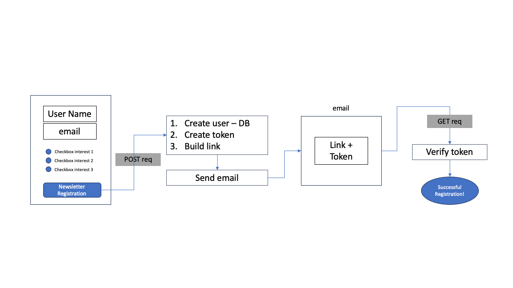

## _Backend---Final-Project_
# Collect & Verify Emails for Mailing List  ✉️
_Please note this is a backend only project_
## Features

- Collects username, email, interests - incl. input validation
- Saves data in MongoDB collection
- Creates & sends verification email via SendGrid
- Updates verified status in database after successful verification

## Functionality

## Tech/Node Modules

Express - MongoDB Atlas - Mongoose - cors  - @sendgrid/mail - cookie-parser - cors - dotenv - express-validator - jsonwebtoken - mongoose

## Try it Yourself

you will need to create a .env file in your root directory with the following environment variables:

- MONGO_USER="your-mongo-username"
- MONGO_PWD="your-mongo-password"
- MONGO_CLUSTER="your-mongo-cluster"
- MONGO_DATABASE="your-mongo-DB"
- MONGO_ROLES="your-mongo-roles"
- SENDGRID_API_KEY="your-sndGrid-API-key"
- TOKEN_SECRET="your-token-secret"

Also you will need to exchange "jane.sender@example.com" with your sendGrid email.

## Tasks
1. mkdir backend
2. cd backend/
3. express install express-generator
4. express --no-view
5. npm install
6. Create .env and .gitignore > node_modules/ and .env
7. npm install express-validator, mongoose, cors, dotenv, express-validator, jsonwebtoken, mongoose 
8. Set up Atlas Project, invite collaborators, set up network access 
9.  Move Mongo DB access info to environment variables
10. connect Mongo DB
11. Create userSchema and userModel for username, email, interests, timestamp
12. Create user router - routes for user signup, user update, signup/:token
13. Create Middleware for signup, user update
14. Error Handler
15. Validate user inputs (validation.js, userRules.js)
16. Create json web token
17. Send confirmation email via sendGrid (sendAuthEmail.js, controller/httpAuthenticateEmail)
18. Confirm email with sendGrid (controller/httpConfirmEmail)
19. Update confirmation status (model/setStatusConfirm)
